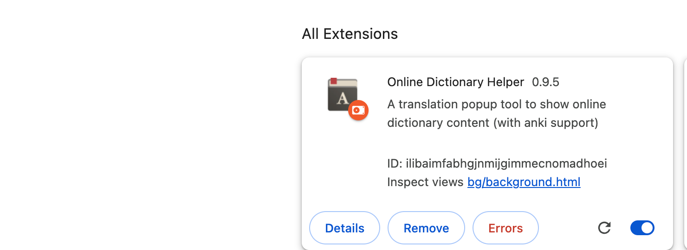

# Online Dictionary Helper (with Anki support)

## add a new dictionary
name youdao enen is english to english , doesn't have any Chinese

steps
1: Add the steps to add a .src folder in Google Chrome; that's all.

[[中文版说明](README.zh_CN.md)]

Online Dictionary Helper is a Chrome/Firefox extension to show definitions for words and phrases from online (or builtin) dictionary via users' selection on any webpage and PDF documents (using [pdf.js](https://mozilla.github.io/pdf.js/)), which also supports flash-card creation using [Anki](https://github.com/dae/anki) (with **[AnkiConnect](https://github.com/FooSoft/anki-connect)**, an Anki add-on, installed).

Details on the reasons for making this extension can be found in the [background](doc/background.md) introduction if you are interested.

What might set this extension apart is that users can grab online dictionary content with their own customized script (running under extension development mode). For development details, please check the [development guide](doc/development.md).

## How to use

- [Install from Chrome Web Store](https://chrome.google.com/webstore/detail/anki-online-dictionary-he/lppjdajkacanlmpbbcdkccjkdbpllajb?hl=en)

- [Install from Firefox Add-ons](https://addons.mozilla.org/en-US/firefox/addon/online-dictionary-helper/)

1. Install the extension first from Chrome Web Store or Firefox Add-ons, then configure and activate the extension on your demands in the options page.
2. Open any webpage, move your mouse cursor over the word that you want to select and translate, drag and select/double-click/press **Hotkey** (defined in options page) to select the word or phrase.
3. If the word or phrase is a clickable link, use the predefined **Hotkey** or hold the <kbd>Alt</kbd> key while selecting to translate.
4. A popup window will show up above the selection displaying the word definition.
5. (Optional) While Anki and AnkiConnect are installed and running, go to the `Services Options` tab in the options page to setup the Anki deck, type, and field names to put your **expression**, **sentence**, **reading**, **definition**, etc.
6. (Optional) Press the green **(+)** button on the top right corner of each definition in the popup window to add the word or phrase to Anki as a note.

## The Options Page

The options of this extension are divided into three sections.

1. General Options
    - Enabled: Turn the extension on/off.
    - AutoSel.Hotkey: Configure the **Hotkey** to select words or phrases. Four options are available: Off(Disable the hotkey), <kbd>Shift</kbd>, <kbd>Ctrl</kbd>, and <kbd>Alt</kbd> key.
    - Max.Context: Set the maximum number of sentences extracted from the context of the webpage.
    - Max.Example: Set the maximum number of example sentences from the dictionary (requires support of the dictionary script).

2. AnkiConnect Options: Setup Anki deck/type name, and which note fields you are going to put **expression**, **sentence**, **reading**, **definition**, etc.

3. Dictionary Options:
    - Dictionary Script: Input your own script name here, and click <kbd>Load Script</kbd> button to load it.
    - Selected Dictionary: Choose the dictionary (bultin or loaded) for the definitions on your preference.

## Development
### Getting started
The source code of this extension on Github does not contain offline dictionary and English word deformation table data. You can go to the Chrome Web Store to download, or use a Chrome extension downloader to download the plugin's crx file and extract the dictionary JSON file.

### Use existing script or develop by yourself

1. You can use existing dictionary scripts in the [dictionaries list](doc/scriptlist.md).
2. Or develop the script by yourself based on [development guide](doc/development.md).
3. Or open an [issue](https://github.com/ninja33/ODH/issues) in this repo if you really need help.

### Pull request

Pull requests are welcome if you want to enhance this extension, or submit your own dictionary script in the next release.

- The extension source will go to [/src](https://github.com/ninja33/ODH/tree/master/src)
- The dictionary script will go to [/src/dict](https://github.com/ninja33/ODH/tree/master/src/dict)
